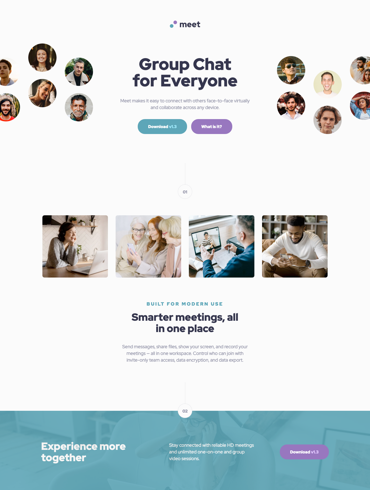

# Frontend Mentor - Meet landing page solution

This is a solution to the [Meet landing page challenge on Frontend Mentor](https://www.frontendmentor.io/challenges/meet-landing-page-rbTDS6OUR). Frontend Mentor challenges help you improve your coding skills by building realistic projects. 

## Table of contents

- [Overview](#overview)
  - [The challenge](#the-challenge)
  - [Screenshot](#screenshot)
  - [Links](#links)
- [My process](#my-process)
  - [Built with](#built-with)
  - [What I learned](#what-i-learned)

## Overview

### The challenge

Users should be able to:

- View the optimal layout depending on their device's screen size
- See hover states for interactive elements

### Screenshot

### Links

- Solution URL: [https://github.com/zakhi/meet-landing-page](https://github.com/zakhi/meet-landing-page)
- Live Site URL: [https://zakhi.github.io/meet-landing-page/](https://zakhi.github.io/meet-landing-page/)

## My process

### Built with

- Semantic HTML5 markup
- Flexbox
- Mobile-first workflow

### What I learned

* How to crop an image using `overflow: hidden`, width over 100% and negative margins.
* How to draw the section number vertical line.
* How to add a background image with opacity.
* Using `flex-shrink`
